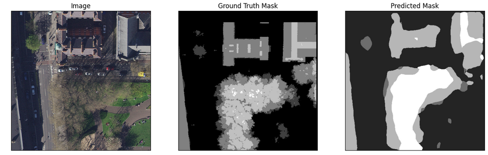
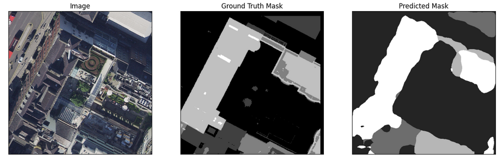
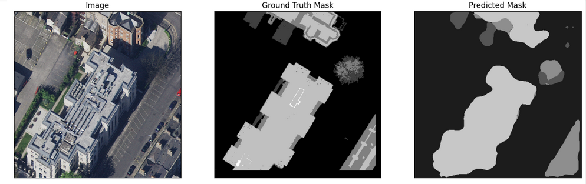

# Segmentation of Satellite Imagery for Built Structure Detection

## Data

- The Data use in the project is used provided by the OSI which can be found [here](https://drive.google.com/drive/folders/14sBkjeYY7R1S9NzWI5fGLX8XTuc8puHy).

- The directory structure to be followed for the code is:\
`Data`\
|\
|____ `Train`\
|&emsp;&emsp;&emsp;&emsp;|\
|&emsp;&emsp;&emsp;&emsp;|______Image\
|&emsp;&emsp;&emsp;&emsp;|\
|&emsp;&emsp;&emsp;&emsp;|______Mask\
|\
| _____`Test`\
&emsp;&emsp;&emsp;&emsp;|\
&emsp;&emsp;&emsp;&emsp;|______Image\
&emsp;&emsp;&emsp;&emsp;|\
&emsp;&emsp;&emsp;&emsp;|______Mask

## Model

- The architecture used in the project is the DeepLabV3 explained in [Rethinking Atrous convolution for semantic image segmentation](https://arxiv.org/abs/1706.05587).

## Results

- The evaluation metrics are as follows\
<space> `Training Dice loss: 0.09218`\
`Training IoU Score: 0.8353`\
`Validation Dice loss: 0.1483`\
`Validaation IoU Score: 0.7471`\
`Test Dice loss: 0.1482`\
`Test IoU Score: 0.7517`

    
    
    